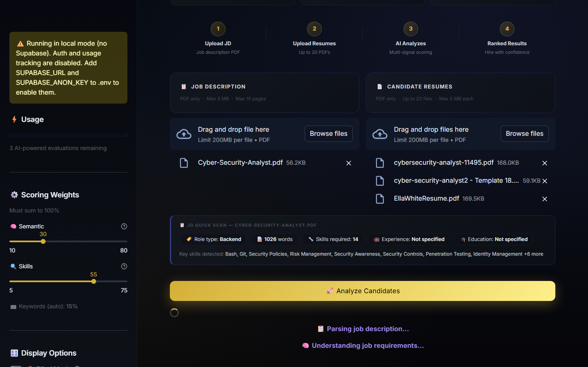
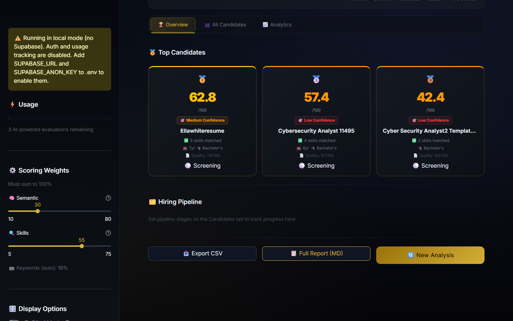
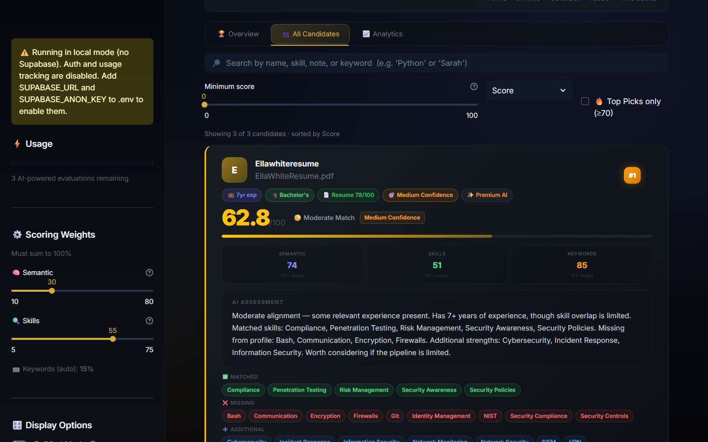
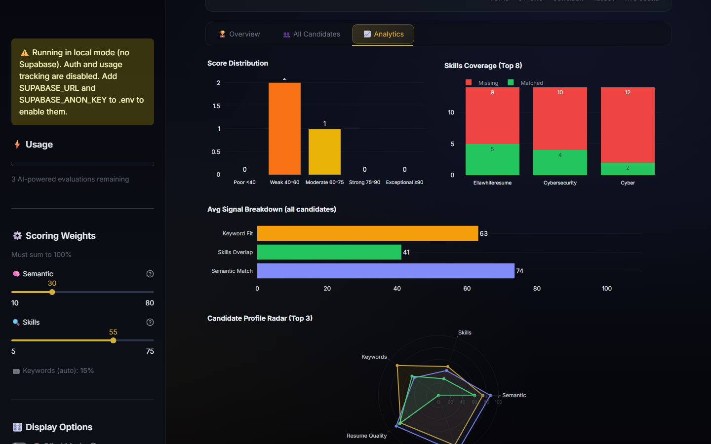

# HireFlow AI

> AI-powered resume screener for recruiters — screen 100+ candidates in seconds with explainable, multi-signal scoring.


---

## Overview

HireFlow AI ranks resumes against a job description using a three-signal hybrid scoring engine: semantic embeddings, skill overlap analysis, and LLM judgment. Results are ranked, explained in plain English, and exportable — all without leaving your browser.

Works fully offline (Zero-Cost Mode) with a local ML model and no API key required.

---

## Live Demo — Cyber Security Analyst Role

> Real screening run: 1 JD + 3 candidate resumes, scored end-to-end with NVIDIA Gemma 4 31B.

### Step 1 — Upload JD & Resumes, then click Analyze


### Step 2 — Processing (AI scores all candidates in parallel)


### Step 3 — Results Overview (ranked podium)


| Rank | Candidate | Score | Confidence |
|------|-----------|-------|------------|
| 🥇 1 | EllaWhiteResume | **62.8** | Medium |
| 🥈 2 | Cybersecurity Analyst 11495 | **57.4** | Low |
| 🥉 3 | Cyber Security Analyst2 | **42.4** | Low |

### Step 4 — Candidate Detail (AI explanation + score breakdown)


### Step 5 — Analytics (score distribution, skills coverage, radar chart)


---

## UI Screenshots

### Sidebar — Scoring Weights (30 / 55 / 15) + AI Backend Status


### Feature Grid


---

## Features

| Feature | Description |
|---------|-------------|
| **Hybrid AI Scoring** | Semantic embeddings + skill overlap + LLM judgment blended into one transparent score |
| **Auto Backend Fallback** | Primary API exhausted? Automatically falls back through configured providers → Ollama local |
| **Zero-Cost Mode** | Works 100% offline with local ML — no API key needed |
| **Blind Mode** | Hides candidate names during scoring to reduce unconscious bias |
| **Interview Packs** | Auto-generates tailored interview questions for each candidate — export as markdown |
| **Analytics Charts** | Score distribution histogram and skills-coverage chart for the full candidate pool |
| **Skills Gap Analysis** | Per-candidate matched, missing, and extra skills breakdown |
| **Export Anywhere** | Download results as CSV or a full markdown interview report with one click |
| **Pipeline Board** | Move candidates through Screened → Interview → Offer → Rejected stages |
| **JD Scanner** | Scan any job description to preview required skills before uploading resumes |
| **Radar Charts** | Visual skills radar per candidate (experience, education, quality, tier) |
| **Session History** | Past screenings saved to Supabase — reload any session from the sidebar |
| **Auth & Usage Tracking** | Email/password + OAuth sign-in via Supabase Auth |

---

## Scoring Pipeline

```
PDF → Text → Batch Embed → Skills Extract → LLM Score → Hybrid Blend → Rank → Display
```

### Hybrid Score Formula

```
final_score = W₁ × embedding_similarity + W₂ × skill_overlap + W₃ × llm_confidence
```

Default weights (tunable in sidebar):

| Signal | Default | What it captures |
|--------|---------|-----------------|
| Semantic Similarity | 30% | Conceptual alignment between resume and JD |
| Skill Overlap | 55% | Keyword/skill checklist coverage |
| LLM Confidence | 15% | AI judgment on seniority fit, red flags, trajectory |

Weights are adjustable via sliders in the sidebar — must sum to 100%.

---

## Quick Start

```bash
# 1. Clone
git clone https://github.com/Rajbharti06/hireflow-ai.git
cd hireflow-ai

# 2. Install dependencies
pip install -r requirements.txt

# 3. Configure environment
cp .env.example .env
# Edit .env and add your keys (see Configuration below)

# 4. Install the global `hireflow` command
pip install -e .

# 5. Run from anywhere
hireflow
```

The app opens at `http://localhost:8501` with the browser launching automatically.

**No API key?** Leave all LLM keys blank — the app falls back to Zero-Cost Mode using the local `all-MiniLM-L6-v2` sentence-transformer (~80 MB, downloaded on first run).

### `hireflow` CLI options

```bash
hireflow                # start on :8501, opens browser
hireflow --port 8502    # different port
hireflow --no-browser   # headless / server use
hireflow --stop         # kill running instance
hireflow --help
```

---

## Configuration

Copy `.env.example` to `.env` and fill in the values you need:

| Variable | Required | Description |
|----------|----------|-------------|
| `NVIDIA_API_KEY` | Optional | NVIDIA NIM key — Gemma 4 31B explanations (recommended) |
| `OPENAI_API_KEY` | Optional | OpenAI key for GPT-4o-mini LLM scoring and explanations |
| `ANTHROPIC_API_KEY` | Optional | Claude (Haiku) for explanations |
| `GEMINI_API_KEY` | Optional | Google Gemini 2.0 Flash |
| `PPLX_API_KEY` | Optional | Perplexity AI |
| `GROK_API_KEY` | Optional | xAI Grok |
| `AI_BACKEND` | Optional | Primary backend (`nvidia`, `openai`, `claude`, `gemini`, `ollama` …) |
| `SUPABASE_URL` | Optional | Supabase project URL — enables auth and session history |
| `SUPABASE_ANON_KEY` | Optional | Supabase anon key — used for auth and read queries |
| `SUPABASE_SERVICE_KEY` | Optional | Service-role key — bypasses RLS for server-side DB writes |

Without Supabase keys the app runs in local mode — auth and history are disabled but all scoring works.

---

## AI Backends

HireFlow AI supports multiple LLM providers and automatically falls back when one is exhausted.

### Automatic Fallback (v4.2+)

```
Primary (AI_BACKEND) → other configured providers → Ollama (local)
```

- **Credit exhaustion** (401/402/403/429): backend is marked dead for the session; next provider is tried automatically. A toast appears in the sidebar when a switch happens.
- **Content filter** (400/422): falls back to the next backend; Ollama never content-filters.
- **Retry**: use the *Retry API connections* button in the sidebar after refreshing an API key.

### NVIDIA NIM (recommended)
- Set `NVIDIA_API_KEY` in `.env` and `AI_BACKEND=nvidia`
- Uses Gemma 4 31B for explanations and DeepSeek V3.2 for skills extraction

### OpenAI
- Set `OPENAI_API_KEY` in `.env`
- Uses `gpt-4o-mini` — fast and cost-effective

### Ollama (free, local, private)
- Install: [ollama.com](https://ollama.com)
- Run: `ollama serve` then `ollama pull mistral`
- Select the active model from the sidebar dropdown

### Zero-Cost Mode (no API key)
- Uses only the local sentence-transformer for semantic scoring
- Rule-based explanations still run — no API calls made

---

## Architecture

| Module | Purpose |
|--------|---------|
| `app.py` | Streamlit UI — upload, process, display ranked results |
| `parser.py` | PDF → clean text via pdfplumber |
| `embedder.py` | Text → 384-dim vectors via sentence-transformers |
| `scorer.py` | Hybrid scoring engine — embedding + skills + LLM blend |
| `explainer.py` | LLM explanations, skill extraction, multi-provider routing with auto-fallback |
| `skills_local.py` | Rule-based skill extraction, experience/education detection, resume quality scoring |
| `interview_gen.py` | Interview question generation per candidate |
| `database.py` | Supabase persistence — sessions, results, history |
| `supabase_client.py` | Supabase client setup (anon + service-role) |
| `utils.py` | Shared helpers (name extraction, text truncation) |
| `hireflow_cli.py` | Global `hireflow` CLI launcher — loads `.env`, uses project venv |

---

## Database Schema

Requires two tables in Supabase (`supabase_schema.sql` included):

- **`jobs`** — one row per screening session (job title, description, user)
- **`results`** — one row per candidate per session (scores, explanation, skills JSON, shortlist flag)
- **`profiles`** — one row per user (usage tracking)

Row Level Security (RLS) is enforced on all tables. The service-role key (`SUPABASE_SERVICE_KEY`) is used for server-side writes to bypass RLS.

---

## Tech Stack

- **Python 3.10+**
- **Streamlit** — UI framework
- **pdfplumber** — PDF text extraction
- **sentence-transformers** (`all-MiniLM-L6-v2`) — local semantic embeddings
- **scikit-learn** — cosine similarity
- **NVIDIA NIM / OpenAI / Claude / Gemini / Ollama** — LLM explanations with auto-fallback
- **Supabase** — auth, PostgreSQL database, RLS
- **Plotly** — analytics charts and radar visualizations
- **pandas** — result table and CSV export

---

## Development

```bash
# Run with auto-reload
streamlit run app.py

# Or use the installed command
hireflow

# Generate sample PDFs for testing
python generate_pdfs.py

# Re-capture README screenshots
python take_screenshots.py    # UI screenshots
python demo_screenshots.py    # end-to-end demo with real PDFs
```

---

## Changelog

| Version | Highlights |
|---------|-----------|
| v4.2 | Auto AI backend fallback chain, Ollama model selector, `hireflow` CLI command, HTML-safe explanations, live weight labels in score breakdown |
| v4.1 | Confidence levels, scoring rebalance, API hardening, security skills |
| v4.0 | Supabase auth, service-role writes, advanced features |
| v3.x | Pipeline board, blind mode, weight tuner, JD scan, radar charts |

---

## License

This project is licensed under the **GNU Affero General Public License v3.0 (AGPL-3.0)**.

> ⚠️ If you use this code in a hosted service or SaaS product, you are required to open-source your entire codebase under the same license.

See [LICENSE](LICENSE) for the full terms.

## Commercial Use

For commercial licensing or private use without the AGPL open-source obligation, please contact the author via GitHub.

This project is open for community use under AGPL, with a commercial licensing path available for businesses.
